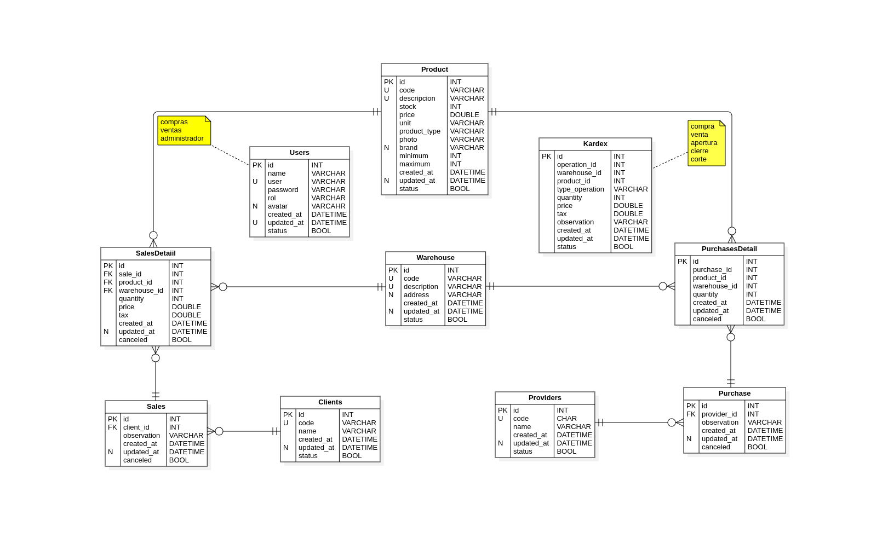

# Base de datos de Punto de venta

## Modelo entidad relación



## Script SQL

```sql
--* -------------------------------------------------
--* Database pointSale
--* -------------------------------------------------
DROP DATABASE IF EXISTS pointSale;
CREATE DATABASE IF NOT EXISTS pointSale;
USE pointSale;

--* -------------------------------------------------
--* Table Users
--* -------------------------------------------------
DROP TABLE IF EXISTS Users;
CREATE TABLE IF NOT EXISTS Users
(
  id         INT          NOT NULL AUTO_INCREMENT,
  name       VARCHAR(45)  NOT NULL,
  user       VARCHAR(45)  NOT NULL,
  password   VARCHAR(45)  NOT NULL,
  rol        VARCHAR(45)  NOT NULL DEFAULT 'ventas',
  avatar     VARCHAR(255)     NULL DEFAULT NULL,
  created_at DATETIME     NOT NULL DEFAULT NOW(),
  updated_at DATETIME         NULL DEFAULT NULL,
  status     BOOLEAN      NOT NULL DEFAULT TRUE,
  CONSTRAINT pkUser       PRIMARY KEY(id),
  CONSTRAINT ukUser       UNIQUE(user)
);
--* -------------------------------------------------
--* Table Kardex
--* -------------------------------------------------
DROP TABLE IF EXISTS Kardex;
CREATE TABLE IF NOT EXISTS Kardex
(
  id             INT           NOT NULL AUTO_INCREMENT,
  operation_id   INT           NOT NULL DEFAULT 0,
  warehouse_id   INT           NOT NULL DEFAULT 0,
  product_id     INT           NOT NULL DEFAULT 0,
  type_operation VARCHAR(45)   NOT NULL                 COMMENT 'compra|venta|apertura|cierre|corte',
  quantity       INT           NOT NULL DEFAULT 0,
  price          DOUBLE        NOT NULL DEFAULT 0,
  tax            DOUBLE        NOT NULL DEFAULT 0,
  observation    VARCHAR(225)      NULL DEFAULT NULL,
  created_at     DATETIME      NOT NULL DEFAULT NOW(),
  updated_at     DATETIME         NULL DEFAULT NULL,
  status         BOOLEAN       NOT NULL DEFAULT TRUE,
  CONSTRAINT     pkKardex      PRIMARY KEY(id)
);
--* -------------------------------------------------
--* Table Products
--* -------------------------------------------------
DROP TABLE IF EXISTS Products;
CREATE TABLE IF NOT EXISTS Products
(
  id             INT           NOT NULL AUTO_INCREMENT,
  code           VARCHAR(45)   NOT NULL,
  description    VARCHAR(65)   NOT NULL,
  stock          INT           NOT NULL DEFAULT 0,
  price          DOUBLE        NOT NULL DEFAULT 0,
  unit           VARCHAR(45)   NOT NULL DEFAULT 'Pieza',
  product_type   VARCHAR(45)   NOT NULL DEFAULT 'producto'  COMMENT 'producto|servicio',
  photo          VARCHAR(255)      NULL DEFAULT NULL,
  brand          VARCHAR(65)       NULL DEFAULT NULL,
  minimum        INT           NOT NULL DEFAULT 0,
  maximum        INT           NOT NULL DEFAULT 0,
  created_at     DATETIME      NOT NULL DEFAULT NOW(),
  updated_at     DATETIME          NULL DEFAULT NULL,
  status         BOOLEAN       NOT NULL DEFAULT TRUE,
  CONSTRAINT     pkProduct     PRIMARY KEY(id),
  CONSTRAINT     ukProduct     UNIQUE(code, description)
);
--* -------------------------------------------------
--* Table Warehouses
--* -------------------------------------------------
DROP TABLE IF EXISTS Warehouses;
CREATE TABLE IF NOT EXISTS Warehouses
(
  id             INT           NOT NULL AUTO_INCREMENT,
  code           VARCHAR(45)   NOT NULL,
  description    VARCHAR(255)  NOT NULL,
  address        VARCHAR(255)      NULL DEFAULT NULL,
  created_at     DATETIME      NOT NULL DEFAULT NOW(),
  updated_at     DATETIME          NULL DEFAULT NULL,
  status         BOOLEAN       NOT NULL DEFAULT TRUE,
  CONSTRAINT     pkWarehouse   PRIMARY KEY(id),
  CONSTRAINT     ukWarehouse   UNIQUE(code, description)
);
--* -------------------------------------------------
--Table Clients
--* -------------------------------------------------
DROP TABLE IF EXISTS Clients;
CREATE TABLE IF NOT EXISTS Clients
(
  id             INT           NOT NULL AUTO_INCREMENT,
  code           VARCHAR(45)   NOT NULL,
  name           VARCHAR(255)  NOT NULL,
  created_at     DATETIME      NOT NULL DEFAULT NOW(),
  updated_at     DATETIME          NULL DEFAULT NULL,
  status         BOOLEAN       NOT NULL DEFAULT TRUE,
  CONSTRAINT     pkClient      PRIMARY KEY(id),
  CONSTRAINT     ukClient      UNIQUE(code)
);
--* -------------------------------------------------
--* Table Providers
--* -------------------------------------------------
DROP TABLE IF EXISTS Providers;
CREATE TABLE IF NOT EXISTS Providers
(
  id             INT           NOT NULL AUTO_INCREMENT,
  code           VARCHAR(45)   NOT NULL,
  name           VARCHAR(225)  NOT NULL,
  created_at     DATETIME      NOT NULL DEFAULT NOW(),
  updated_at     DATETIME          NULL DEFAULT NULL,
  status         BOOLEAN       NOT NULL DEFAULT TRUE,
  CONSTRAINT     pkProvider    PRIMARY KEY(id),
  CONSTRAINT     ukProvider    UNIQUE(code)
);
--* -------------------------------------------------
--* Table Sales
--* -------------------------------------------------
DROP TABLE IF EXISTS Sales;
CREATE TABLE IF NOT EXISTS Sales
(
  id             INT           NOT NULL AUTO_INCREMENT,
  client_id      INT           NOT NULL,
  observation    VARCHAR(255)  NOT NULL,
  created_at     DATETIME      NOT NULL DEFAULT NOW(),
  updated_at     DATETIME          NULL DEFAULT NULL,
  status         BOOLEAN       NOT NULL DEFAULT TRUE,
  CONSTRAINT     pkSale        PRIMARY KEY(id),
  CONSTRAINT     fkSaleClient  FOREIGN KEY(client_id) REFERENCES Clients(id) ON DELETE CASCADE
);
--* -------------------------------------------------
--* Table Purchase
--* -------------------------------------------------
DROP TABLE IF EXISTS Purchases;
CREATE TABLE IF NOT EXISTS Purchases
(
  id             INT                NOT NULL AUTO_INCREMENT,
  provider_id    INT                NOT NULL,
  observation    VARCHAR(255)       NOT NULL,
  created_at     DATETIME           NOT NULL DEFAULT NOW(),
  updated_at     DATETIME               NULL DEFAULT NULL,
  status         BOOLEAN            NOT NULL DEFAULT TRUE,
  CONSTRAINT     pkPurchase         PRIMARY KEY(id),
  CONSTRAINT     fkPurchaseProvider FOREIGN KEY(provider_id) REFERENCES Providers(id) ON DELETE CASCADE
);
--* -------------------------------------------------
--* Table SalesDetail
--* -------------------------------------------------
DROP TABLE IF EXISTS SalesDetail;
CREATE TABLE IF NOT EXISTS SalesDetail
(
  id             INT                    NOT NULL AUTO_INCREMENT,
  sale_id        INT                    NOT NULL,
  product_id     INT                    NOT NULL,
  warehouse_id   INT                    NOT NULL,
  quantity       DOUBLE                 NOT NULL DEFAULT 0,
  price          DOUBLE                 NOT NULL DEFAULT 0,
  tax            DOUBLE                 NOT NULL DEFAULT 0,
  created_at     DATETIME               NOT NULL DEFAULT NOW(),
  updated_at     DATETIME                   NULL DEFAULT NULL,
  canceled       BOOLEAN                NOT NULL DEFAULT FALSE,
  CONSTRAINT     pkSaleDetail           PRIMARY KEY(id),
  CONSTRAINT     fkSaleDetailSale       FOREIGN KEY(sale_id) REFERENCES Sales(id) ON DELETE CASCADE,
  CONSTRAINT     fkSaleDetailProduct    FOREIGN KEY(product_id) REFERENCES Products(id) ON DELETE CASCADE,
  CONSTRAINT     fkSaleDetailWarehouse  FOREIGN KEY(warehouse_id) REFERENCES Warehouses(id) ON DELETE CASCADE
);
--* -------------------------------------------------
--* Table PurchasesDetail
--* -------------------------------------------------
DROP TABLE IF EXISTS PurchasesDetail;
CREATE TABLE IF NOT EXISTS PurchasesDetail
(
  id             INT                        NOT NULL AUTO_INCREMENT,
  purchase_id    INT                        NOT NULL,
  product_id     INT                        NOT NULL,
  warehouse_id   INT                        NOT NULL,
  quantity       DOUBLE                     NOT NULL DEFAULT 0,
  price          DOUBLE                     NOT NULL DEFAULT 0,
  tax            DOUBLE                     NOT NULL DEFAULT 0,
  created_at     DATETIME                   NOT NULL DEFAULT NOW(),
  updated_at     DATETIME                       NULL DEFAULT NULL,
  canceled       BOOLEAN                    NOT NULL DEFAULT FALSE,
  CONSTRAINT     pkPurchaseDetail           PRIMARY KEY(id),
  CONSTRAINT     fkPurchaseDetailPurchase   FOREIGN KEY(purchase_id) REFERENCES Purchases(id) ON DELETE CASCADE,
  CONSTRAINT     fkPurchaseDetailProduct    FOREIGN KEY(product_id) REFERENCES Products(id) ON DELETE CASCADE,
  CONSTRAINT     fkPurchaseDetailWarehouse  FOREIGN KEY(warehouse_id) REFERENCES Warehouses(id) ON DELETE CASCADE
);

--* -------------------------------------------------
--* Inserts
--* -------------------------------------------------
INSERT INTO Warehouses (code, description) VALUES ('AG', 'Almacén general');
INSERT INTO Clients (code, name) VALUES ('general', 'Cliente general');

```
